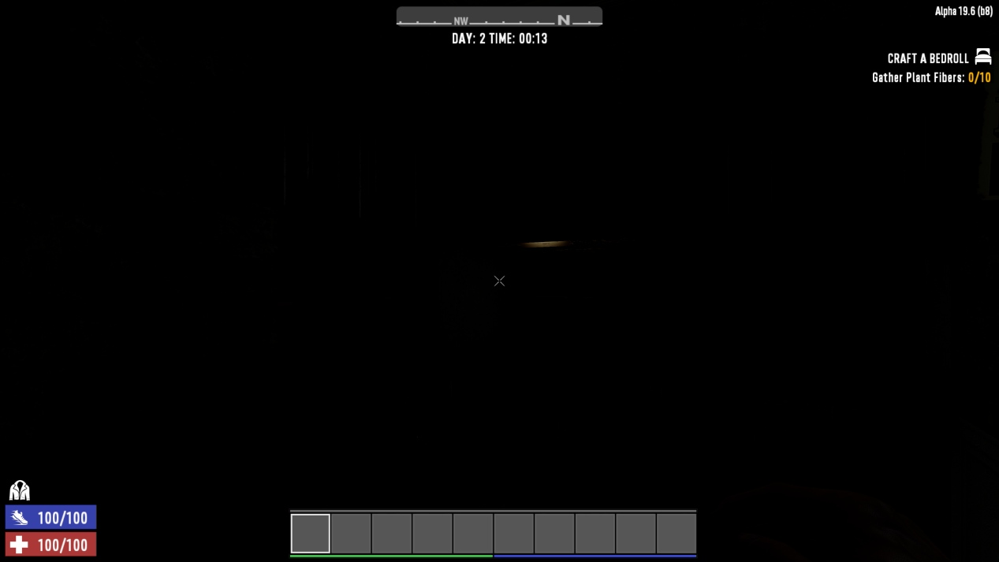
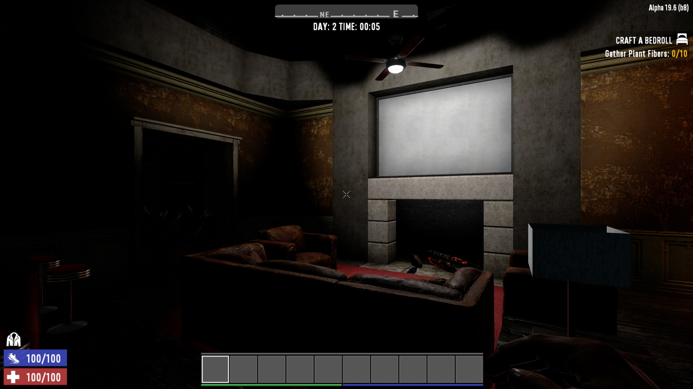
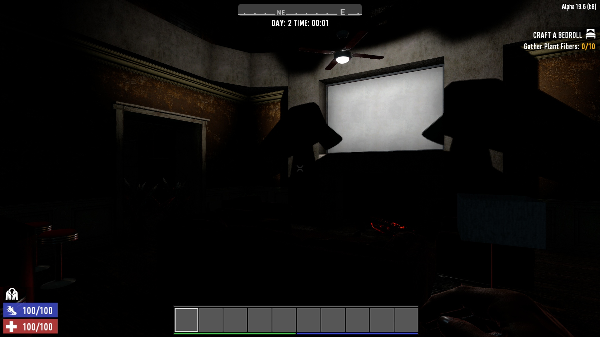

# OCB Electricity Light Soft Shadows - 7 Days to Die (DMT/Harmony) Addon

Very simple mod that enables soft shadows for all lights. Even if you crank
up all your settings, some lights will shine through everything in their way.
This yields weird reflections where there should be none. There are certainly
reasons why TFP didn't enable this for all lights, but why did you pay for that
expensive GFX card!? Expect at least some fps drops in light intensive areas!

It greatly adds to the darkness and immersion, specially during the night.
Might be too dark for some people's liking though, but you be the judge:

Of course if performance strain is too big, we could also try to use
hard shadows instead, which should alleviate some stress from the GPU.

## Compatibility

I've developed and tested this Mod against version a19.6b8.

[1]: https://github.com/HAL-NINE-THOUSAND/DMT